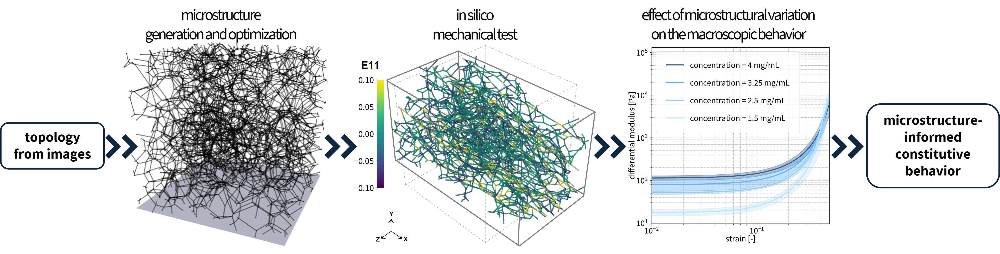
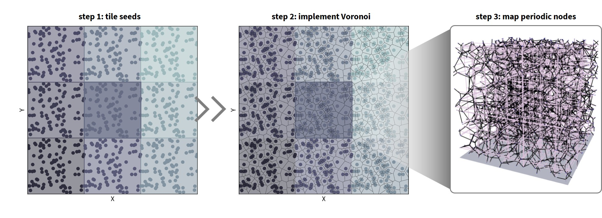
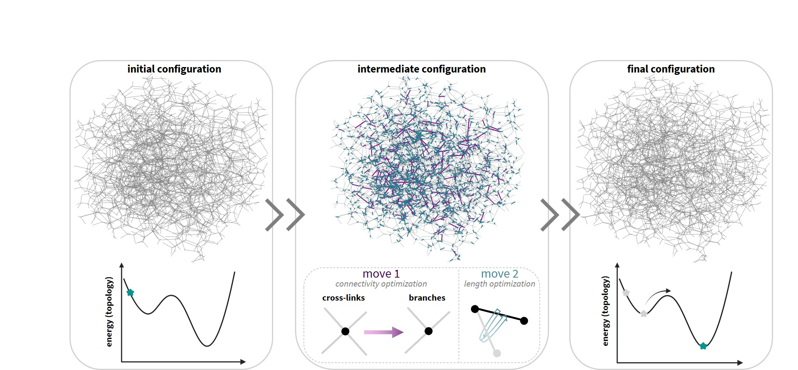
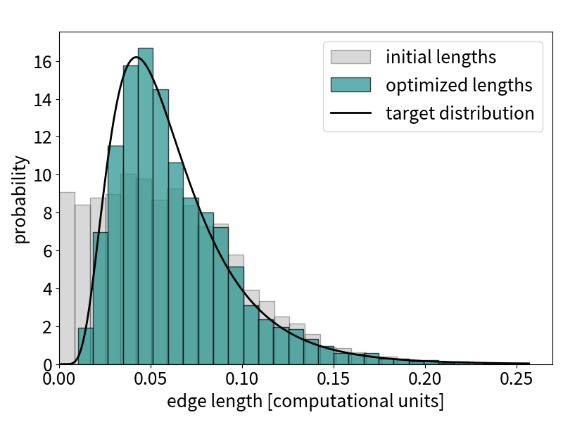
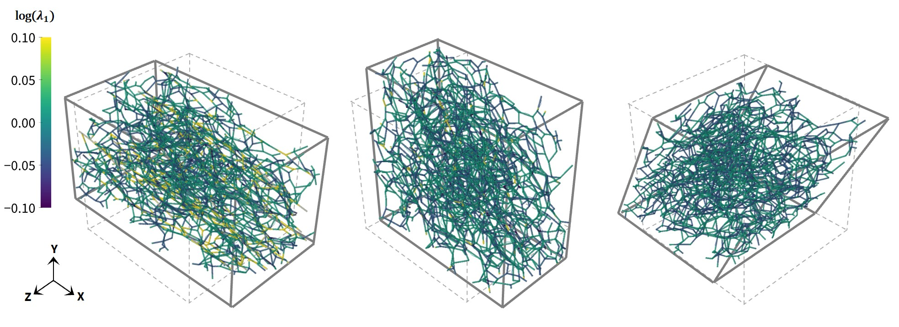

# TopoGEN
TopoGEN is a framework that integrates three-dimensional image-informed fiber network generation with non-linear finite element analysis to support the mechanistic investigation of structure-function relationships in soft matter. 



## Copyright
Copyright (c) Sara Cardona, PhD Researcher, ME, TU Delft (2025)

When using this work, please cite:
https://doi.org/10.1016/j.jmps.2025.106257

~~~bibtex
@article{Cardona2025,
  title = {TopoGEN: Topology-driven microstructure generation for in silico modeling of fiber network mechanics},
  volume = {205},
  ISSN = {0022-5096},
  url = {http://dx.doi.org/10.1016/j.jmps.2025.106257},
  DOI = {10.1016/j.jmps.2025.106257},
  journal = {Journal of the Mechanics and Physics of Solids},
  publisher = {Elsevier BV},
  author = {Cardona,  Sara and Peirlinck,  Mathias and Fereidoonnezhad,  Behrooz},
  year = {2025},
  month = dec,
  pages = {106257}
}
~~~

## Requirements
- **Python**: pre-processing and data analysis
- **Fortran**: bilinear USDFLD fiber behavior
- **Abaqus Standard**: model solver

## Overview
The central component is the [`src`](./src) folder that implements the logic to generate the topologies and build the Abaqus input files for micromechanical modeling. Everything is embedded into one single main.py file. The auxiliary files in the source folder are intended to perform the following steps:

The main simulation pipeline is orchestrated by the `main.py` file in the `src` folder. It is designed to be flexible for both single-sample tests and parametric studies using Latin Hypercube Sampling (LHS).

### Modes
- **Single Sample Mode**: By default, the pipeline runs a single test with fixed parameters (seed count, valency, fiber radius, edge length, etc.).
- **LHS Parametric Study**: If enabled, the pipeline generates multiple samples across a parameter space using LHS, allowing systematic exploration of network properties.

### User Parameters
Parameters such as anisotropy, domain size, fiber radius, valency, and mechanical properties are set at the top of `main.py`. You can adjust these to match your experimental or modeling needs.

### Steps
The pipeline proceeds through four main steps:

1. **STEP 1: Network Generation** ([network generation](src/create_periodic_network.py))

  - Generates a periodic 3D Voronoi network based on user parameters.
  - Supports both isotropic and anisotropic cases (directional stretching and Hermans parameter).

2. **STEP 2: Optimization**  [network optimization](src/optimize_periodic_network.py)


  - Optimizes network valency and edge lengths to match target values.
  - For anisotropic cases, only valency optimization is performed.

3. **STEP 3: Refinement**
  - Refines the network by removing dangling ends and ensuring connectivity.
  - Extracts the largest connected component and remaps indices.

4. **STEP 4: Abaqus Input Generation**  [Abaqus input files](src/write_abaqus_input_file.py)


  - Scales the network to physical dimensions and generates Abaqus input files.
  - Computes physical properties (volume fraction, concentration, slenderness, etc.).
  - Handles periodic boundary conditions and mesh refinement options.

### Output
For each sample, the pipeline creates a dedicated output folder containing all generated files (network, periodic pairs, Abaqus input, logs, etc.).


## Quick start
1. Install dependencies:
    - Python example:
      ```bash
      pip install -r requirements.txt
      ```
    - or use your preferred package manager / environment.

2. Run the main pipeline:
    - Execute the main script:
      ```bash
      python src/main.py
      ```
    - This will generate the fiber network, optimize the structure, refine the network, and create Abaqus input files.

3. Customize parameters:
    - Edit the configuration or parameters in src/main.py as needed for your specific tests.

4. Review outputs:
    - Generated files and results will be saved in the working directory or specified output folders.

## Contributing
Thank you for using TopoGEN! For any inquiries, additional help, customization, or any other problems/concerns/suggestions, please reach out to us via email. The author of this codes is Sara Cardona (s.cardona@tudelft.nl).

## Copyright
Copyright (c) Sara Cardona, PhD Researcher, ME, TU Delft (2025)

To Cite this work please cite one of these articles:
https://doi.org/10.1016/j.jmps.2025.106257
